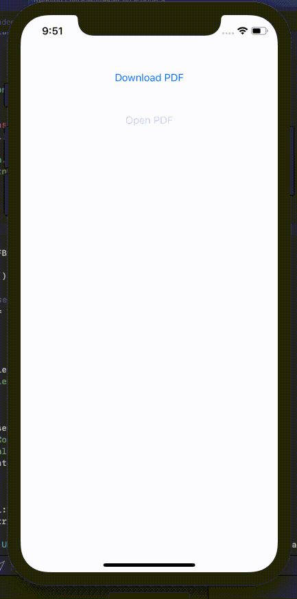

# FileDownloader

a Swift app to download and Store a PDF File with the ability to open it. The original tutorial is this: https://medium.com/@ji3g4kami/download-store-and-view-pdf-in-swift-af399373b451

Simple & Clean :)

# Note:
To Allow downloading from http websites, you need to add this to your info.plist
```<key>NSAppTransportSecurity</key>
<dict>
    <key>NSAllowsArbitraryLoads</key>
    <true/>
</dict>
```

